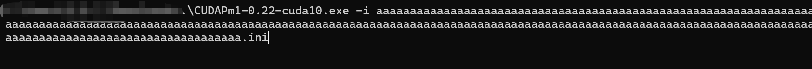
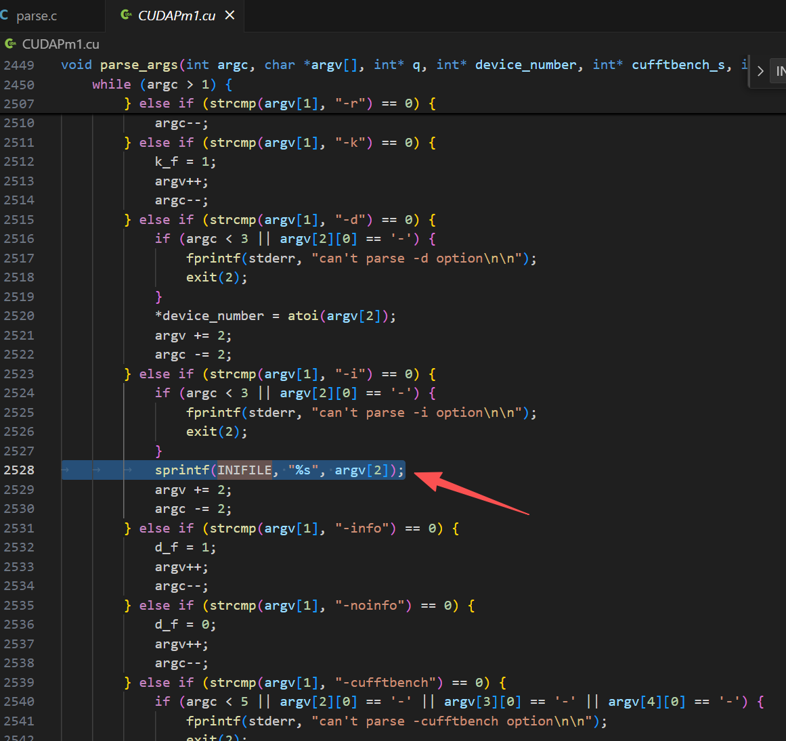
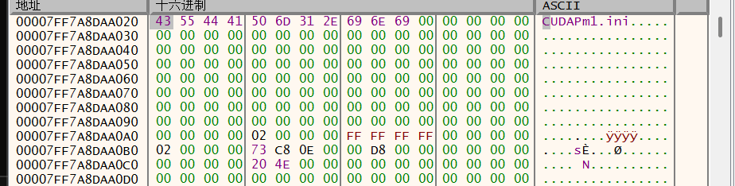
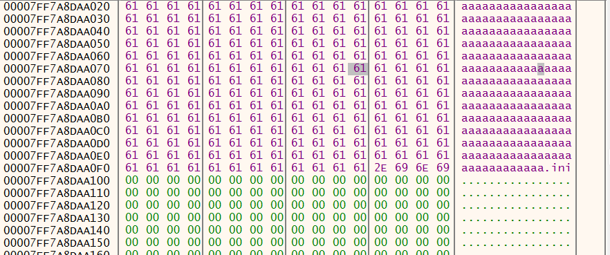

### 💥 Vulnerability Report : Buffer Overflow

------

**1. Product:**

- **Name:**  CUDAPm1
- **Version:** 0.22
- **Repository:** https://github.com/BleuSquid/cuda-p1/releases/tag/0.22

------

**2. Vulnerability Type:**

- **Type:** Buffer Overflow (Out-of-bounds Write)

------

**3. Affected Component(s):**

- Command-line argument handling for the -i option

------

**4. Attack Vector(s):**

Local — the vulnerability is triggered by supplying a crafted value to the -i command-line option when executing the application.

**5. Proof of Concept (PoC):**

```
The vulnerability can be triggered by supplying an overly long string to the `-i` command-line argument.

Example:

CUDAPm1.exe -i <long_string>

Where `<long_string>` is a sufficiently long sequence of characters (e.g., repeated 'A's).  
When executed, the application copies the user-controlled input into a fixed-size buffer using `sprintf` without length validation, resulting in a buffer overflow and application crash.

```


**6. Vulnerable Code Reference**

The vulnerability resides in the handling of the `-i` command-line argument.



The application copies user-supplied input directly into a fixed-size buffer using `sprintf` without performing any bounds checking:

sprintf(INIFILE, "%s", argv[2]);

INIFILE is a fixed-size buffer, and no length validation is performed before copying.

CUDAPm1.cu  2528




Since the length of `argv[2]` is not validated, supplying an overly long string results in a buffer overflow.

Before overflow：



After overflow：





**7. Impact:**

- Memory corruption
- Denial of Service (DoS)
- Undefined behavior


**8. References:**

https://github.com/BleuSquid/cuda-p1/releases/tag/0.22